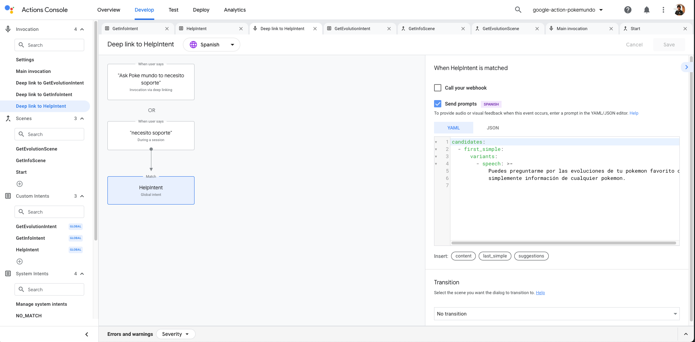
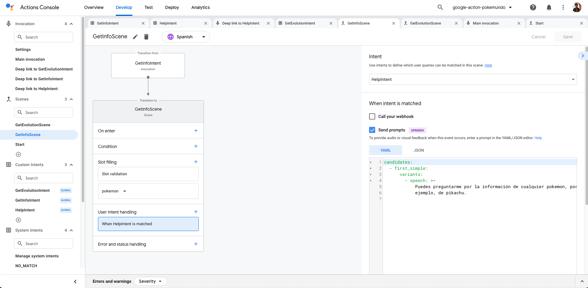
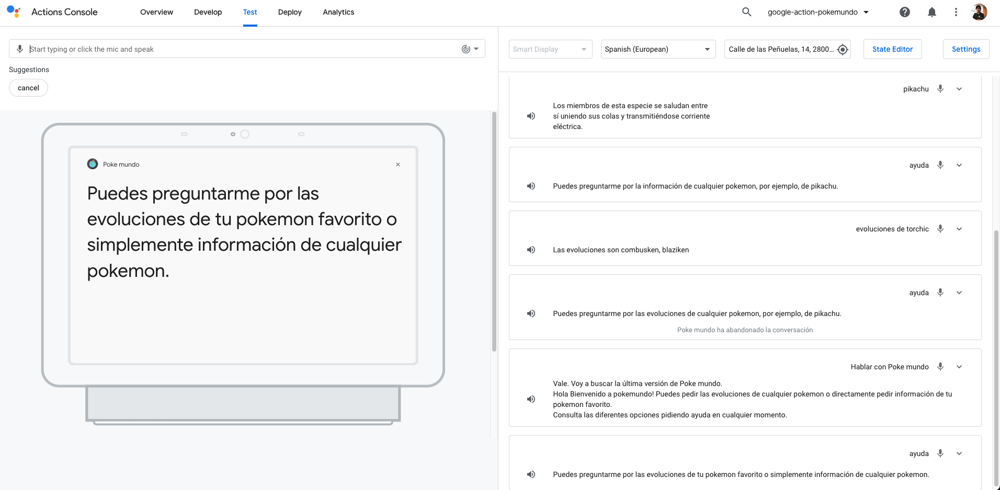
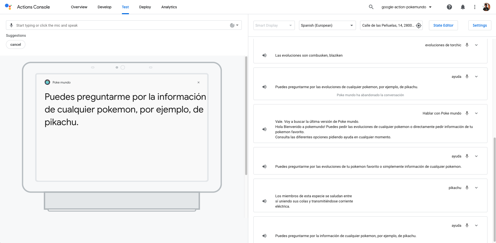

# Contextual Design with Google Actions

<!-- TOC -->

- [Contextual Design with Google Actions](#contextual-design-with-google-actions)
  - [Prerequisites](#prerequisites)
  - [Use Case](#use-case)
  - [How to implement Contextual Design in our Google Actions](#how-to-implement-contextual-design-in-our-google-actions)
    - [Global Intent Handling](#global-intent-handling)
    - [Intent Handling within a Scene](#intent-handling-within-a-scene)
    - [Result](#result)
  - [Resources](#resources)
  - [Conclusion](#conclusion)

<!-- /TOC -->

One of the most complex tasks while designing a conversation is to create natural interactions with our users. There is one process that helps us to create those natural conversations. This process is called contextual design. With the contextual design, you can design your conversation depending on the current situation of our users. For example, if the user is the first time that uses our Google Action, we will tell him/her a different welcome message than if he/she access it for the second time. Another example is the following one: if the user is from one City, we will provide information related to that city accessing geoinformation. Contextual design is one of the keys of Conversational AI.

In this article, we will learn how to create engaging conversations using contextual design in our Google Action.

## Prerequisites

Here you have the technologies used in this project
1. Google Action Developer Account - [How to get it](https://console.actions.google.com/)
2. Google Cloud Account - [Sign up here for free](https://cloud.google.com/)
3. Firebase Account - [Sign up here for free](https://firebase.google.com/)
4. gactions CLI - [Install and configure gactions CLI](https://github.com/actions-on-google/gactions)
5. Firebase CLI - [Install and configure Firebase CLI](https://firebase.google.com/docs/cli)
6. Node.js v10.x
7. Visual Studio Code
8. yarn Package Manager
9. Google Action SDK for Node.js (Version >3.0.0)

The Google Actions Command Line Interface (gactions CLI) is a tool for you to manage your Google Actions and related resources, such as Firebase Cloud functions.
gactions CLI allows you to manage Google Actions programmatically from the command line.
We will use this powerful tool to create, build, deploy and manage our Google Action. Let's start!

## Use Case

The scenario that we want to create is when a user request help while he/she is using our google action. How?
1. First, We are going to have a global intent called `HelpIntent` that will be triggered when we access our Google Action or when we are not in any Scene that has an intent handling section that handles the same intent.
2. Second, thanks to the intent handling section of the Scenes in Google Actions we will add a handler for the intent `HelpIntent` to provide specific information.

## How to implement Contextual Design in our Google Actions

The first thing that we are going to do is to create our `HelpIntent` and set this as a global one:

```yaml
    trainingPhrases:
    - I need support
    - I need Help
    - support
    - help me
    - help
```

This custom intent will be located down `sdk/custom/intents` folder and this is how it looks on the Google Action Developer Console:


**NOTE:** In the image above you are seeing the examples in Spanish.

### Global Intent Handling

As we have created our Global `HelpIntent`, we can create a global deep-link to this intent whenever is triggered to provide a global help to our users:

This global deep link is located down `sdk/custom/global`:

```yaml
    handler:
    staticPrompt:
        candidates:
        - promptResponse:
            firstSimple:
            variants:
            - speech: You can ask me about the evolutions of your favourite pokemon
                  or just information of any pokemon.

```
This is how it looks like on the Google Action Developer Console:



**NOTE:** In the image above you are seeing the examples in Spanish.

When this deep link will be triggered?
1. With one-shot interaction. Like the user saying something like `Ok Google, talk to <you-invocation-name> to <HelpIntent utterance>`
2. When the `HelpIntent` utterance is triggered and it is not matched in any intent handling section of our Scenes in our Google Action.

### Intent Handling within a Scene

So, what happens if we want to add some specific help when we are requesting information about a pokemon for example? for that, we are going to use the Intent Handling section of the Google Action Scenes. In our case, we will use the Scene called `GetInfoScene`. This scene is enabled whenever our users request information about some specific pokemon. 

Let's take a look at its code:

```yaml
    intentEvents:
    - handler:
        staticPrompt:
        candidates:
        - promptResponse:
            firstSimple:
                variants:
                - speech: You can ask me for the information of any pokemon,
                     for example, about Pikachu.
    intent: HelpIntent
    onSlotUpdated:
    webhookHandler: GetInfoHandler
    slots:
    - name: pokemon
    required: true
    type:
        name: pokemon
```

As you can see above down the `intentEvents` section, which is the Intent Handling section of our Scene, that we are intercepting our intent `HelpIntent` and we are providing a specific prompt to our users.

This is how it looks like in the Google Action Developer Console:



**NOTE:** In the image above you are seeing the examples in Spanish.

In the examples above we are just sending the prompt to our users directly from the Scenes or the Global Intent Handling but you can call your Firebase Cloud Function as well.

Also, it is a good practice to have multiple variants of our prompts to have a rich conversation experience.

### Result

Having everything developed, this will be the final result. First, when we enter our Google Action we will get generic help:



And this will be the help that we are going to get when we are asking for information about a pokemon:




## Resources
* [Official Google Assistant Node.js SDK](https://github.com/actions-on-google/assistant-conversation-nodejs) - Official Google Assistant Node.js SDK
* [Official Google Assistant Documentation](https://developers.google.com/assistant/conversational/overview) - Official Google Assistant Documentation

**NOTE:** In the image above you are seeing the examples in Spanish.


## Conclusion 

This was a basic tutorial to learn how to create a contextual design using Google Actions.
As you have seen in this example, the Google Actions SDK helps us a lot while we are developing our Google Actions.
I hope this example project is useful to you.

That's all folks!

Happy coding!
