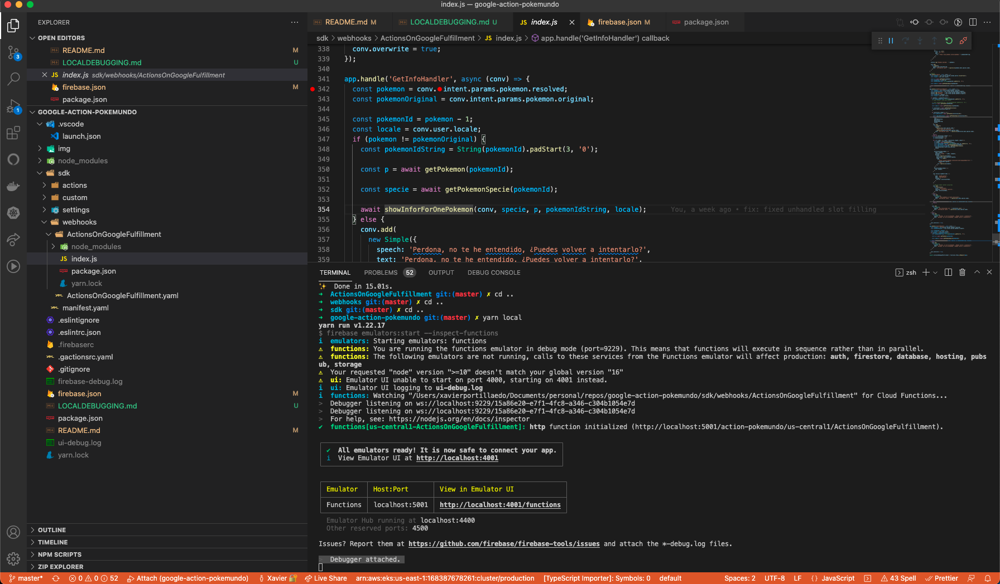

# Local Debugging on a Google Action

Google Actions can be developed using Firebase Cloud functions or a REST API endpoint. 
Firebase Cloud Function function is Googles's implementation of serverless functions available in Firebase. 
Google recommends using Firebase Cloud Function functions for Google Action development.
 
This is a very lightweight and powerful approach to developing our Google Action. However, it is complex to work locally with serverless functions like Firebase Cloud Functions.

In this article, we will learn how to develop our Google Action locally by invoking our Firebase Cloud Function locally.

## Prerequisites

Here you have the technologies used in this project
1. Google Action Developer Account - [How to get it](https://console.actions.google.com/)
2. Google Cloud Account - [Sign up here for free](https://cloud.google.com/)
3. Firebase Account - [Sign up here for free](https://firebase.google.com/)
4. gactions CLI - [Install and configure gactions CLI](https://github.com/actions-on-google/gactions)
5. Firebase CLI - [Install and configure Firebase CLI](https://firebase.google.com/docs/cli)
6. Node.js v10.x
7. Visual Studio Code
8. yarn Package Manager
9. Google Action SDK for Node.js (Version >3.0.0)
10. ngrok

The Google Actions Command Line Interface (gactions CLI) is a tool for you to manage your Google Actions and related resources, such as Firebase Cloud functions.
gactions CLI allows you to manage Google Actions programmatically from the command line.
We will use this powerful tool to create, build, deploy and manage our Hello World Google Action. Let's start!

We will use the Firebase CLI as well to invoke our Firebase Cloud Function locally.

## Project Files 

These are the main files of the project:

```bash
├── firebase.json
├── package.json
├── .vscode
│   └── launch.json
└── sdk
    ├── actions
    │   └── actions.yaml
    ├── custom
    │   ├── global
    │   ├── intents
    │   ├── scenes
    │   └── types
    ├── manifest.yaml
    ├── settings
    │   └── settings.yaml
    └── webhooks
        ├── ActionsOnGoogleFulfillment
        │   ├── index.js
        │   └── package.json
        └── ActionsOnGoogleFulfillment.yaml

```

* `package.json`: root file to run local debugging and linting.
* `firebase.json`: Firebase configuration for local debugging.
* `.vscode`:
  * `launch.json`: VS Code configuration to run our Firebase Function locally.
* `sdk`: The main folder of the project. Here we will execute all the gactions CLI commands.
  * `actions`:
    * `actions.yaml`: file that contains some metadata of the Google Action such as the Assistant Link.
  * `custom`: In this folder, we are going to specify our interaction model and the conversation flow.
    * `global`: In this folder, you will find all the intents that can be triggered at any time because they are global.
    * `intents`: Intents defined by us. Each intent will have a list of utterances that Google Assistant will use to train its AI.
    * `scenes`: The different Scenes of our Google Actions. We will use Scenes to manage the flow of our conversation.
    * `types`: the types/entities we are going to use on our intents/utterances.
  * `settings`:
    * `settings.yaml`:This file will contain all the metadata of our Google Action like description, logo, Privacy Policy, Project ID, etc.
  * `webhooks`: A folder that contains the source code of the Firebase Cloud function:
    * `ActionsOnGoogleFulfillment`: Folder with all the Firebase Cloud Function code.
      * `index.js`: the Firebase Cloud Function main entry point.
      * `package.json`: this file is core to the Node.js ecosystem and is a basic part of understanding and working with Node.js, npm, and even modern JavaScript
    * `ActionsOnGoogleFulfillment.yaml`: File that specifies the handlers and the folder of the source code.


## Building the Google Action with Visual Studio Code

Inside the main `package.json` (the one located in the root folder), we will find all the linting `devDependencies` and scripts that will help us to lint our code and run our Firebase Cloud Function.

Here is how this file looks like:

```json

  {  
    "name": "google-action-pokemundo",
    "version": "1.0.0",
    "private": true,
    "description": "Google Action Pokemundo.",
    "engines": {
      "node": ">=10"
    },
    "scripts": {
      "lint": "eslint \"**/*.js\"",
      "lint:fix": "eslint --fix \"**/*.js\"",
      "local": "firebase emulators:start --inspect-functions"
    },
    "devDependencies": {
      "eslint": "^5.2.0",
      "eslint-config-google": "^0.9.1"
    }
  }

```

To install all packages and any packages that those depend on.
```bash

  yarn install

```

### Linting your Code

To run linting on your Firebase Google Cloud Function of your Google Action you just need to run this command:

```bash
  yarn lint
```

Most of the lint issues can be auto-fixed. For that, you can use this command:

```bash
  yarn lint:fix
```

### Running your Firebase Cloud Function locally

To run our Firebase Cloud Function locally we will need to configure the `firebase.json` file in our root folder:

```json
    {
        "functions": {
            "source": "sdk/webhooks/ActionsOnGoogleFulfillment"
        },
        "emulators": {
            "functions": {
                "port": 5001
            }
        }
    }
```

This file specifies the Firebase Emulator for our Firebase Cloud function:
1. First, we specify that our source code is down `sdk/webhooks/ActionsOnGoogleFulfillment` folder.
2. Then, we set the emulator port to 5001. This port will be used to listen to incoming webhook calls.

Once we have the `firebase.yaml` file properly setup, we can run the following command:

```bash
    firebase emulators:start --inspect-functions
```

In this project, I create a yarn script that runs the command above to make it simpler. So you can just run:

```bash
    yarn local
```

This is the console output:

```bash
    ➜  google-action-pokemundo git:(master) ✗ yarn local
    yarn run v1.22.17
    $ firebase emulators:start --inspect-functions
    i  emulators: Starting emulators: functions
    ⚠  functions: You are running the functions emulator in debug mode (port=9229). This means that functions will execute in sequence rather than in parallel.
    ⚠  functions: The following emulators are not running, calls to these services from the Functions emulator will affect production: auth, firestore, database, hosting, pubsub, storage
    ⚠  Your requested "node" version ">=10" doesn't match your global version "16"
    ⚠  ui: Emulator UI unable to start on port 4000, starting on 4001 instead.
    i  ui: Emulator UI logging to ui-debug.log
    i  functions: Watching "/Users/xavierportillaedo/Documents/personal/repos/google-action-pokemundo/sdk/webhooks/ActionsOnGoogleFulfillment" for Cloud Functions...
    >  Debugger listening on ws://localhost:9229/15a86e20-e7f1-4fc8-a346-c304b1054e7d
    >  Debugger listening on ws://localhost:9229/15a86e20-e7f1-4fc8-a346-c304b1054e7d
    >  For help, see: https://nodejs.org/en/docs/inspector
    ✔  functions[us-central1-ActionsOnGoogleFulfillment]: http function initialized (http://localhost:5001/action-pokemundo/us-central1/ActionsOnGoogleFulfillment).

    ┌─────────────────────────────────────────────────────────────┐
    │ ✔  All emulators ready! It is now safe to connect your app. │
    │ i  View Emulator UI at http://localhost:4001                │
    └─────────────────────────────────────────────────────────────┘

    ┌───────────┬────────────────┬─────────────────────────────────┐
    │ Emulator  │ Host:Port      │ View in Emulator UI             │
    ├───────────┼────────────────┼─────────────────────────────────┤
    │ Functions │ localhost:5001 │ http://localhost:4001/functions │
    └───────────┴────────────────┴─────────────────────────────────┘
    Emulator Hub running at localhost:4400
    Other reserved ports: 4500

    Issues? Report them at https://github.com/firebase/firebase-tools/issues and attach the *-debug.log files.
    

```
**NOTE:** make sure you specified your current project to the one that you are working on by running `firebase use <YOUR_PROJECT_ID>`


You can access to the Firebase Simulator UI locally here: `http://localhost:4001/`:


### Attaching the debugger

The step above just executes the Firebase Cloud Function locally. This is not enough, we will need to attach to the node process in order to be able to set up breakpoints and inspct the nodeJS code.

The `launch.json` file in `.vscode` folder has the configuration for Visual Studio Code which allow us to attach to the node process:

```json

    {
        "configurations": [
            {
                "type": "node",
                "request": "attach",
                "name": "Attach",
                "port": 9229 
            }
        ]
    }

```
When we run the VS Code configuration file we will see this output on the console:

```bash
    >  Debugger attached.    
```

This configuration uses the standard node debugger port `9229` to attach the process and intercept the calls and inspect the code.


After configuring our launch.json file and understanding how the local debugger works, it is time to click on the play button:



From now on you can make a request to your Firebase Cloud Function locally: `http://localhost:5001/action-pokemundo/us-central1/ActionsOnGoogleFulfillment`

## Testing requests locally

I'm sure you already know the famous tool called [Postman](https://www.postman.com/). REST APIs have become the new standard in providing a public and secure interface for your service. Though REST has become ubiquitous, it's not always easy to test. Postman makes it easier to test and manage HTTP REST APIs. Postman gives us multiple features to import, test and share APIs, which will help you and your team be more productive in the long run.

After running your application you will have an endpoint available at `http://localhost:5001/action-pokemundo/us-central1/ActionsOnGoogleFulfillment`. With Postman you can emulate any Google Action Request. 


## Test requests directly from Google Assistant

ngrok is a very cool, lightweight tool that creates a secure tunnel on your local machine along with a public URL you can use for browsing your local site or APIs.

When ngrok is running, it listens on the same port that you’re local web server is running on and proxies external requests to your local machine

From there, it’s a simple step to get it to listen to your web server. Say you’re running your local web server on port 5001. In the terminal, you’d type in: `ngrok http 5001`. This starts ngrok listening on port 5001 and creates the secure tunnel:


So now you have to go to [Google Action Developer console](https://console.actions.google.com/), go to your Google Action > Test tab > settings, add the https URL generated above. Eg: `https://d424-83-138-195-117.ngrok.io:5001/action-pokemundo/us-central1/ActionsOnGoogleFulfillment`.

The Google Action Developer Console will send an HTTPS request to the ngrok endpoint (https://d424-83-138-195-117.ngrok.io:5001/action-pokemundo/us-central1/ActionsOnGoogleFulfillment) which will route it to your Google Action running on Web API server at `http://localhost:5001/action-pokemundo/us-central1/ActionsOnGoogleFulfillment`.


## Debugging the Google Action with Visual Studio Code

Following the steps before, now you can set up breakpoints wherever you want inside all JS files to debug your Google Action:


## Resources
* [Official Google Assistant Node.js SDK](https://github.com/actions-on-google/assistant-conversation-nodejs) - Official Google Assistant Node.js SDK
* [Official Google Assistant Documentation](https://developers.google.com/assistant/conversational/overview) - Official Google Assistant Documentation


## Conclusion 

This was a basic tutorial to learn how to develop Google Actions locally.
As you have seen in this example, the gactions CLI and the Firebase CLI can help us while we are developing.
I hope this example project is useful to you.

That's all folks!

Happy coding!
