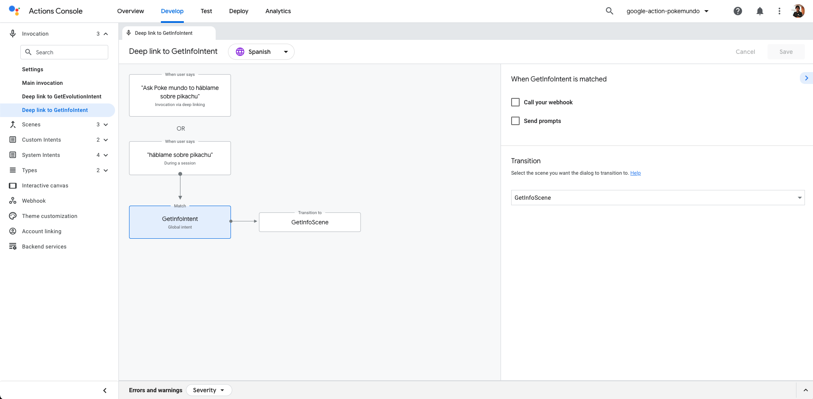
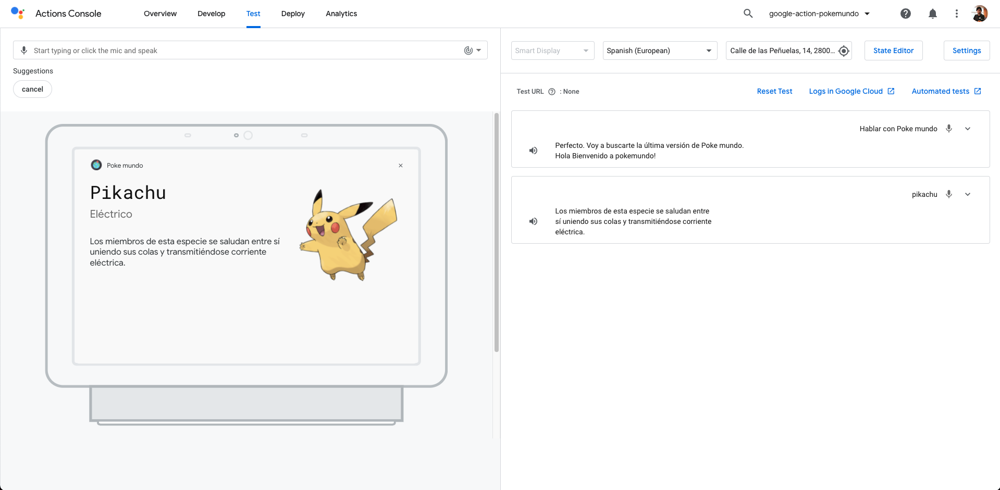

# Multimodal Design with Google Actions: Rich Responses using Cards

<!-- TOC -->

- [Multimodal Design with Google Actions: Rich Responses using Cards](#multimodal-design-with-google-actions-rich-responses-using-cards)
  - [Prerequisites](#prerequisites)
  - [Use Case](#use-case)
  - [Google Actions and Rich Responses](#google-actions-and-rich-responses)
  - [Rich Responses on our Firebase Cloud Function](#rich-responses-on-our-firebase-cloud-function)
    - [Result](#result)
  - [Resources](#resources)
  - [Conclusion](#conclusion)

<!-- /TOC -->

Creating conversations is a really hard task. This is an entire design process that can take a lot of time. In terms of voice assistants, this process is even more complex due to the ability to interact with the user using sound and a display. When you mix those 2 interactions, you are creating a multimodal experience.

In this article, we will learn how to create engaging conversations using multimodality in our Google Action thanks to its Rich Responses using Cards.

## Prerequisites

Here you have the technologies used in this project
1. Google Action Developer Account - [How to get it](https://console.actions.google.com/)
2. Google Cloud Account - [Sign up here for free](https://cloud.google.com/)
3. Firebase Account - [Sign up here for free](https://firebase.google.com/)
4. gactions CLI - [Install and configure gactions CLI](https://github.com/actions-on-google/gactions)
5. Firebase CLI - [Install and configure Firebase CLI](https://firebase.google.com/docs/cli)
6. Node.js v10.x
7. Visual Studio Code
8. yarn Package Manager
9. Google Action SDK for Node.js (Version >3.0.0)

The Google Actions Command Line Interface (gactions CLI) is a tool for you to manage your Google Actions and related resources, such as Firebase Cloud functions.
gactions CLI allows you to manage Google Actions programmatically from the command line.
We will use this powerful tool to create, build, deploy and manage our Google Action. Let's start!

## Use Case

The scenario that we want to create is when a user request information about a pokemon, we can show that information using multimodality. How?
1. First, what we are going to tell the user, using voice/sound is the full explanation of the Pokemon requested.
2. Second, thanks to a display, we will show the user some extra information about this Pokemon like its type, image, description and a link that the user can click and search for more information about this Pokemon.

Here it is important to balance the information that we are going to tell/show to our users to not lose them. For example, a good practice is to show on the display just extra information or a summary of what you are telling using voice. It is better to use the display as a platform to help/guide the users rather than confuse them.

Also, it is important to notice here that not all users have a Smart Speaker with display capabilities. So we will need to figure out how to manage the scenario using audio+display and only audio:


## Google Actions and Rich Responses

Google Assistant and its Google Actions have multiple ways to create visual responses. In this article, we are going to talk about Rich Responses. These are the available ones:
1. Basic Card: With these cards, you will show the user a summary of the information, some extra/additional information or more specific information. Using these cards, you can show the user an image, title, subtitle, a little text and a button with a link. The link is not available on Smart Speakers.
2. Image Card: This card is simpler than the Basic Card. You can just show an image here.
3. Table Card: This Card is used to present a table on a display.

You can check the full explanation [here](https://developers.google.com/assistant/conversational/prompts-rich).

## Rich Responses on our Firebase Cloud Function

Using this Rich Response on our Firebase Cloud Functions is quite easy thanks to the Google Action SDK `@assistant/conversation`.

For this Example what we are going to create is a Global Intent called `GetInfoIntent`:

```yaml
  parameters:
  - name: pokemon
    type:
      name: pokemon
  trainingPhrases:
  - háblame sobre ($pokemon 'pikachu' auto=false)
  - quién es ($pokemon 'pikachu' auto=false)
  - dame más información sobre ($pokemon 'pikachu' auto=false)
  - ($pokemon 'pikachu' auto=false)
  - qué pokemon es ($pokemon 'pikachu' auto=false)
```

As you can see above we have slots that are using the Custom Type `pokemon`.

When this Global Intent is triggered, we will transition to the `GetInfoScene`.

```yaml
  transitionToScene: GetInfoScene
```



Finally, here you have the `GetInfoScene` specification:

```yaml
  onSlotUpdated:
    webhookHandler: GetInfoHandler
  slots:
  - name: pokemon
    required: true
    type:
      name: pokemon
```


As you can see on the Scene above, we set the `pokemon` slot as required and every time the slot value changes, we are going to call our Firebase Cloud Function. The handler that will handle the requests of these scenes is called `GetInfoHandler`.

This handler will detect if the device that is making the request accepts rich responses, and if it is the case, it will create a `Card` (Basic Card). Otherwise, it will use just voice/sound.

So, how can we detect if a device accepts Rich Responses or not? Easy, you can the device capabilities like this:

```javascript

    const supportsRichResponse = conv.device.capabilities.includes('RICH_RESPONSE');

  if (supportsRichResponse) {
    // Rich Response
  } else{
    // Simple Response
  }

```

As we are going to play with `Card`, `Image`, `Link` and `Simple` objects we will need to import them:
```javascript
  const {
    conversation,
    Card,
    Simple,
    Link,
    Image,
  } = require('@assistant/conversation');
```

If we have the concepts above clear, we just need to set our handler:

```javascript

  app.handle('GetInfoHandler', async (conv) => {
    const pokemon = conv.intent.params.pokemon.resolved;
    const pokemonOriginal = conv.intent.params.pokemon.original;

    const pokemonId = pokemon - 1;
    const locale = conv.user.locale;
    if (pokemon != pokemonOriginal) {
      const pokemonIdString = String(pokemonId).padStart(3, '0'); // It sets 3 to 003 or 25 to 025

      const p = await getPokemon(pokemonId);

      const specie = await getPokemonSpecie(pokemonId);

      await showInforForOnePokemon(conv, specie, p, pokemonIdString, locale);
    } else {
      conv.add(
        new Simple({
          speech: 'Sorry, I didn\'t understand you, can you try again?',
          text: 'Sorry, I didn\'t understand you, can you try again?',
        })
      );
    }

    conv.overwrite = true;
  });

```

We will use some extra functions to fetch information about Pokemons using the [PokeAPI](https://pokeapi.co/):
1. First, we will get the general information about the pokemon that the user is requesting. That code is the `getPokemon` function.
2. Then, we will get the Pokemon Specie to get the description using the function called `getPokemonSpecie`.
3. Finally, we are ready to prepare the response by calling `showInforForOnePokemon`.

The function `showInforForOnePokemon` is the most important one. There we are going to prepare the response for our users:

```javascript
/**
 * Capitalizes a string
 * @param {string} conv The conversation object.
 * @param {string} specie The Specie of the Pokemon for PokeAPI.
 * @param {string} pokemon The pokemon object from PokeAPI.
 * @param {string} pokemonIdString The Pokemon Id in string format.
 * @param {string} locale The locale of the user.
 */
  async function showInforForOnePokemon(
    conv,
    specie,
    pokemon,
    pokemonIdString,
    locale
  ) {
    let descriptionString = getPokemonDescription(
      specie.data.flavor_text_entries,
      locale
    );
    const types = await getPokemonTypes(pokemon.data.types, locale);

    const supportsRichResponse =
      conv.device.capabilities.includes('RICH_RESPONSE');

    if (supportsRichResponse) {
      conv.add(
        new Card({
          title: capitalize(pokemon.data.species.name),
          subtitle: types,
          text: capitalize(descriptionString),
          image: new Image({
            height: 500,
            width: 500,
            url: 'https://assets.pokemon.com/assets/cms2/img/pokedex/full/' + pokemonIdString +'.png',
            alt: capitalize(pokemon.data.species.name),
          }),
          button: new Link({
            name: 'More info',
            open: {
              url: 'https://www.pokemon.com/en/pokedex/' + pokemonIdString,
            },
          }),
        })
      );
    }

    conv.add(
      new Simple({
        speech: descriptionString,
        text: 'Info about ' + capitalize(pokemon.data.species.name),
      })
    );
  }
```

Reding the code above we will see that if the device has the rich response capability we will add to the conversation a new `Card`. That Card will have these properties:
1. Title: the Pokemon's name
2. Subtitle: The Pokemon types that we get using the `getPokemonTypes` function.
3. Image: the official image of that Pokemon accessing pokemon.com
4. Link: In non-smart Speakers, we will show a link that will redirect to the official Pokemon webpage of this specific Pokemon.

### Result

Having everything developed, this will be the final result from a Smart Speaker:



And this will be the result on mobile with the `Link` button:


## Resources
* [Official Google Assistant Node.js SDK](https://github.com/actions-on-google/assistant-conversation-nodejs) - Official Google Assistant Node.js SDK
* [Official Google Assistant Documentation](https://developers.google.com/assistant/conversational/overview) - Official Google Assistant Documentation


## Conclusion 

This was a basic tutorial to learn how to create a multimodal experience using Google Actions.
As you have seen in this example, the Google Actions SDK helps us a lot while we are developing our Google Actions.
I hope this example project is useful to you.

That's all folks!

Happy coding!
