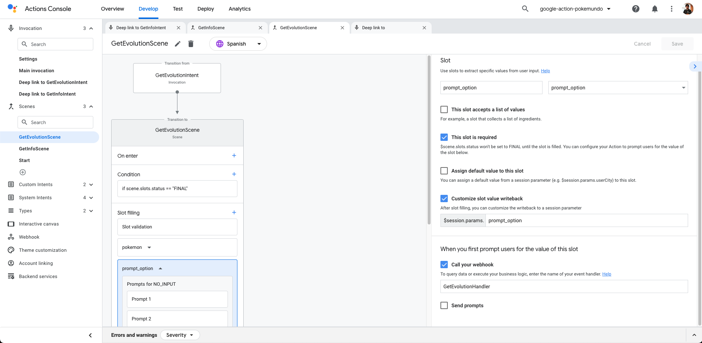
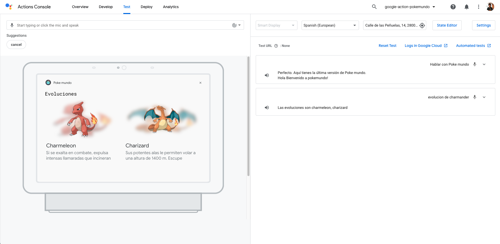

# Multimodal Design with Google Actions: Visual Selection Responses using Collections

<!-- TOC -->

- [Multimodal Design with Google Actions: Visual Selection Responses using Collections](#multimodal-design-with-google-actions-visual-selection-responses-using-collections)
  - [Prerequisites](#prerequisites)
  - [Use Case](#use-case)
  - [Google Actions and Visual Selection Responses using Collections](#google-actions-and-visual-selection-responses-using-collections)
  - [Visual Selection Responses on our Firebase Cloud Function](#visual-selection-responses-on-our-firebase-cloud-function)
    - [A pokemon only has one evolution](#a-pokemon-only-has-one-evolution)
    - [A pokemon has more than one evolution](#a-pokemon-has-more-than-one-evolution)
    - [A pokemon does not have any evolutions](#a-pokemon-does-not-have-any-evolutions)
    - [Result](#result)
  - [Resources](#resources)
  - [Conclusion](#conclusion)

<!-- /TOC -->

Creating conversations is a really hard task. This is an entire design process that can take a lot of time. In terms of voice assistants, this process is even more complex due to the ability to interact with the user using sound and a display. When you mix those 2 interactions, you are creating a multimodal experience.

In this article, we will learn how to create engaging conversations using multimodality in our Google Action thanks to its Visual Selection Responses using Collections.

## Prerequisites

Here you have the technologies used in this project
1. Google Action Developer Account - [How to get it](https://console.actions.google.com/)
2. Google Cloud Account - [Sign up here for free](https://cloud.google.com/)
3. Firebase Account - [Sign up here for free](https://firebase.google.com/)
4. gactions CLI - [Install and configure gactions CLI](https://github.com/actions-on-google/gactions)
5. Firebase CLI - [Install and configure Firebase CLI](https://firebase.google.com/docs/cli)
6. Node.js v10.x
7. Visual Studio Code
8. yarn Package Manager
9. Google Action SDK for Node.js (Version >3.0.0)

The Google Actions Command Line Interface (gactions CLI) is a tool for you to manage your Google Actions and related resources, such as Firebase Cloud functions.
gactions CLI allows you to manage Google Actions programmatically from the command line.
We will use this powerful tool to create, build, deploy and manage our Google Action. Let's start!

## Use Case

The scenario that we want to create is when a user requests the evolutions of a pokemon, we will show that information using multimodality. How?
1. First, what we are going to tell the user, using voice/sound is the name of the evolutions of that pokemon.
2. Second, thanks to a display, we will show the user a collection of images of the evolutions and their description.

So these are the 3 scenarios:
1. If a pokemon has only one evolution we will show to the user a `Card` of the evolution.
2. If a pokemon has multiple evolutions, we will show to the user a `Collection` with all the evolutions.
3. If a pokemon does not have evolutions, we will show to the user a `Card` with the information of the pokemon requested.

Here it is important to balance the information that we are going to tell/show to our users to not lose them. For example, a good practice is to show on the display just extra information or a summary of what you are telling using voice. It is better to use the display as a platform to help/guide the users rather than confuse them.

Also, it is important to notice here that not all users have a Smart Speaker with display capabilities. So we will need to figure out how to manage the scenario using audio+display and only audio:


## Google Actions and Visual Selection Responses using Collections

Google Assistant and its Google Actions have multiple ways to create visual responses. In this article, we are going to talk about Visual Selection Responses using Collections. These are the available ones:
1. List: It will display in vertical a list of items with a Title, Image and a short description. Each item can be selected by voice or touching it.
2. Collection: Same as `List` but it shows the items in horizontal.
3. Collection browse: Same as `Collection` but this collection is only available in devices with web browser capabilities like mobiles. These items can be selected only by touching.

**NOTE:** All the objects above have to have at least 2 items and a maximum of 10.

You can check the full explanation [here](https://developers.google.com/assistant/conversational/prompts-selection).

## Visual Selection Responses on our Firebase Cloud Function

Using these Visual Selection Responses on our Firebase Cloud Functions is quite easy thanks to the Google Action SDK `@assistant/conversation`.

For this Example what we are going to create is a Global Intent called `GetEvolutionIntent`:

```yaml
    parameters:
    - name: pokemon
    type:
        name: pokemon
    trainingPhrases:
    - Dime la evolución de ($pokemon 'pikachu' auto=false)
    - en quién evoluciona ($pokemon 'pikachu' auto=false)
    - quién es la evolución de ($pokemon 'pikachu' auto=false)
    - evolución de ($pokemon 'pikachu' auto=false)
    - evolucion de ($pokemon 'pikachu' auto=false)
    - evoluciones de ($pokemon 'pikachu' auto=false)

```

As you can see above we have slots that are using the Custom Type `pokemon`.

When this Global Intent is triggered, we will transition to the `GetEvolutionScene`.

```yaml
    transitionToScene: GetEvolutionScene
```


Finally, here you have the `GetEvolutionScene` specification:

```yaml
    conditionalEvents:
    - condition: scene.slots.status == "FINAL"
    handler:
        webhookHandler: option
    slots:
    - name: pokemon
    required: true
    type:
        name: pokemon
    - commitBehavior:
        writeSessionParam: prompt_option
    name: prompt_option
    promptSettings:
        initialPrompt:
        webhookHandler: GetEvolutionHandler
    required: true
    type:
        name: prompt_option

```




Let's explain the Scene above because is quite complex. Let's take a look at the Slot Filling section:
1. As you can see, we set the `pokemon` slot as required.
2. Then we have a type called `prompt_option`. The first time we enter the Scene the `GetEvolutionIntent` is triggered and we are going to call our `GetEvolutionHandler`. This handler will create the Virtual Selection Response using a Collection.
3. When we enter this scene, the `pokemon` slot will be filled but the `prompt_option` not. Why? because the value of that slot will be filled when the user chooses one item from the `Collection`. When this slot is filled, the condition `scene.slots.status == "FINAL"` will be true, and then, we will call our `option` handler.
4. Once the user chooses one evolution, the `option` handler will tell/show the information of that pokemon.

All the handlers will detect if the device that is making the request accepts visual selection responses, and if it is the case, it will create a `Collection` or a `Card` (Basic Card). Otherwise, it will use just voice/sound.

So, how can we detect if a device accepts Visual Selection Responses or not? Easy, you can the device capabilities like this:

```javascript

    const supportsRichResponse = conv.device.capabilities.includes('RICH_RESPONSE');

  if (supportsRichResponse) {
    // Rich Response
  } else{
    // Simple Response
  }

```

As we are going to play with `Card`, `Image`, `Link`, `Simple` and `Collection` objects we will need to import them:
```javascript
    const {
    conversation,
    Card,
    Simple,
    Link,
    Image,
    Collection,
    } = require('@assistant/conversation');
```

If we have the concepts above clear, we just need to set our handler:

```javascript

    app.handle('GetEvolutionHandler', async (conv) => {
    const pokemon = conv.intent.params.pokemon.resolved;
    const pokemonOriginal = conv.intent.params.pokemon.original;
    console.log('Resolved ' + conv.intent.params.pokemon.resolved);
    console.log('Original ' + conv.intent.params.pokemon.original);
    const pokemonId = pokemon - 1;
    const locale = conv.user.locale;

    if (pokemon != pokemonOriginal) {
        const pokemonIdString = String(pokemonId).padStart(3, '0');
        // const locale = conv.user.locale;

        // const pokemonIdString = String(pokemonId).padStart(3, '0');
        const p = await getPokemon(pokemonId);

        const specie = await getPokemonSpecie(pokemonId);

        let evolutions = await getPokemonEvolutions(
        specie.data.evolution_chain.url
        );

        // one evolution
        if (evolutions.length == 1) {
        
            const pEvolution = await getPokemon(evolutions[0]);

            const specieEvolution = await getPokemonSpecie(evolutions[0]);
            await showInforForOnePokemon(
                conv,
                specieEvolution,
                pEvolution,
                pokemonIdString,
                locale
            );
            conv.add(
                new Simple({
                speech:
                    capitalize(p.data.species.name) +
                    ' Just have only one evolution: ' +
                    capitalize(pEvolution.data.species.name),
                text: 'Info about ' + capitalize(pEvolution.data.species.name),
                })
            );
            return;

        // more than one evolution
        } else if (evolutions.length > 1) {
        
            let evolutionsItems = [];
            let evolutionsKeys = [];

            for (let index = 0; index < evolutions.length; index++) {
                let element = evolutions[index];
                let pItem = await getPokemon(element);
                const pokemonIdStringItem = String(pItem.data.id).padStart(3, '0');
                const specieItem = await getPokemonSpecie(element);
                const descriptionStringItem = getPokemonDescription(
                specieItem.data.flavor_text_entries,
                locale
                );
                
                // Items in the collection
                evolutionsItems[index] = {
                name: element,
                synonyms: ['Item ' + index, element],
                display: {
                    title: capitalize(element),
                    description: descriptionStringItem,
                    image: new Image({
                    url:
                        'https://assets.pokemon.com/assets/cms2/img/pokedex/full/' +
                        pokemonIdStringItem +
                        '.png',
                    alt: capitalize(element),
                    }),
                },
                };

                // List of the keys for the collection
                evolutionsKeys[index] = {
                key: element,
                };
            }

            conv.session.typeOverrides = [
                {
                name: 'prompt_option',
                mode: 'TYPE_REPLACE',
                synonym: {
                    entries: evolutionsItems,
                },
                },
            ];

            // Define prompt content using keys
            conv.add(
                new Collection({
                title: 'Evoluciones',
                subtitle: 'Collection subtitle',
                items: evolutionsKeys,
                })
            );
        } else {

            // No evolutions
            conv.add(
                new Simple({
                speech: 'This pokemon has not any evolutions',
                text: 'Info about ' + capitalize(p.data.species.name),
                })
            );
            await showInforForOnePokemon(conv, specie, p, pokemonIdString, locale);
            return;
        }

        conv.add(
        new Simple({
            speech: 'The evolutions are ' + evolutions.join(', '),
            text: 'Info about ' + capitalize(p.data.species.name),
        })
        );
    } else {
        conv.add(
        new Simple({
            speech: 'Perdona, no te he entendido, ¿Puedes volver a intentarlo?',
            text: 'Perdona, no te he entendido, ¿Puedes volver a intentarlo?',
        })
        );
    }

    conv.overwrite = true;
    });

```

Let's divide the explanation into the 3 possible scenarios:

### A pokemon only has one evolution

This is the portion of the code that handles when a pokemon has only one evolution:

```javascript
    const pEvolution = await getPokemon(evolutions[0]);

    const specieEvolution = await getPokemonSpecie(evolutions[0]);
    await showInforForOnePokemon(
        conv,
        specieEvolution,
        pEvolution,
        pokemonIdString,
        locale
    );
    conv.add(
        new Simple({
        speech:
            capitalize(p.data.species.name) +
            ' Just have only one evolution: ' +
            capitalize(pEvolution.data.species.name),
        text: 'Info about ' + capitalize(pEvolution.data.species.name),
        })
    );
    return;
```

We will use some extra functions to fetch information about Pokemons using the [PokeAPI](https://pokeapi.co/):
1. First, we will get the general information about the pokemon that the user is requesting. That code is the `getPokemon` function.
2. Then, we will get the Pokemon Specie to get the description using the function called `getPokemonSpecie`.
3. Finally, we are ready to prepare the response by calling `showInforForOnePokemon`.

The function `showInforForOnePokemon` is one of the most important ones. There we are going to prepare the response for our users:

```javascript
/**
 * Capitalizes a string
 * @param {string} conv The conversation object.
 * @param {string} specie The Specie of the Pokemon for PokeAPI.
 * @param {string} pokemon The pokemon object from PokeAPI.
 * @param {string} pokemonIdString The Pokemon Id in string format.
 * @param {string} locale The locale of the user.
 */
  async function showInforForOnePokemon(
    conv,
    specie,
    pokemon,
    pokemonIdString,
    locale
  ) {
    let descriptionString = getPokemonDescription(
      specie.data.flavor_text_entries,
      locale
    );
    const types = await getPokemonTypes(pokemon.data.types, locale);

    const supportsRichResponse =
      conv.device.capabilities.includes('RICH_RESPONSE');

    if (supportsRichResponse) {
      conv.add(
        new Card({
          title: capitalize(pokemon.data.species.name),
          subtitle: types,
          text: capitalize(descriptionString),
          image: new Image({
            height: 500,
            width: 500,
            url: 'https://assets.pokemon.com/assets/cms2/img/pokedex/full/' + pokemonIdString +'.png',
            alt: capitalize(pokemon.data.species.name),
          }),
          button: new Link({
            name: 'More info',
            open: {
              url: 'https://www.pokemon.com/en/pokedex/' + pokemonIdString,
            },
          }),
        })
      );
    }

    conv.add(
      new Simple({
        speech: descriptionString,
        text: 'Info about ' + capitalize(pokemon.data.species.name),
      })
    );
  }
```

Reding the code above we will see that if the device has the rich response capability we will add to the conversation a new `Card`. That Card will have these properties:
1. Title: the Pokemon's name
2. Subtitle: The Pokemon types that we get using the `getPokemonTypes` function.
3. Image: the official image of that Pokemon accessing pokemon.com
4. Link: In non-smart Speakers, we will show a link that will redirect to the official Pokemon webpage of this specific Pokemon.

### A pokemon has more than one evolution

This is the most complex scenario:

```javascript
    let evolutionsItems = [];
    let evolutionsKeys = [];

    for (let index = 0; index < evolutions.length; index++) {
        let element = evolutions[index];
        let pItem = await getPokemon(element);
        const pokemonIdStringItem = String(pItem.data.id).padStart(3, '0');
        const specieItem = await getPokemonSpecie(element);
        const descriptionStringItem = getPokemonDescription(
        specieItem.data.flavor_text_entries,
        locale
        );
        
        // Items in the collection
        evolutionsItems[index] = {
        name: element,
        synonyms: ['Item ' + index, element],
        display: {
            title: capitalize(element),
            description: descriptionStringItem,
            image: new Image({
                url:
                    'https://assets.pokemon.com/assets/cms2/img/pokedex/full/' +
                    pokemonIdStringItem +
                    '.png',
                alt: capitalize(element),
            }),
        },
        };

        // List of the keys for the collection
        evolutionsKeys[index] = {
            key: element,
        };
    }

    conv.session.typeOverrides = [
        {
        name: 'prompt_option',
        mode: 'TYPE_REPLACE',
        synonym: {
            entries: evolutionsItems,
        },
        },
    ];

    // Define prompt content using keys
    conv.add(
        new Collection({
        title: 'Evolutions',
        subtitle: 'Collection of evolutions',
        items: evolutionsKeys,
        })
    );
```

So let's explain the code. The 2 main objects are the arrays that we are going to use to create the `Collection`: `evolutionsItems` and `evolutionsKeys`.

In each evolution we are going to add an object in the `evolutionsItems` array with these properties:
1. Name: In our case, we will use the name of the evolution.
2. Synonyms: here we are going to add all the synonyms of each evolution. In our case, we are going to set the pokemon ID of the evolution and the name of the evolution itself. This will be used by Google Assistant to re-train its AI to be able to detect the evolution we chose using voice.
3. And finally a Display object with these properties:
   1. Title: in our case, the name of the evolution.
   2. Description: Short description of the pokemon.
   3. Image: an image of the evolution

Also, on every iteration, we will add an object to the `evolutionsKeys` array. Each object will have only one property called `key`. We will set that property to the name of the evolution.

**NOTE:** it is important to note here that the `key` property in the `evolutionsKeys` array has to be the same as the `name` property in the `evolutionsItems` array.

Once we have both arrays filled with the information about the evolution we will just need to do 2 things:

First, overrides the values of the type `prompt_option`:
```javascript
    conv.session.typeOverrides = [
        {
        name: 'prompt_option',
        mode: 'TYPE_REPLACE',
        synonym: {
            entries: evolutionsItems,
        },
        },
    ];
```

And finally, Create the `Collection`:

```javascript
    conv.add(
        new Collection({
        title: 'Evolutions',
        subtitle: 'Collection of evolution',
        items: evolutionsKeys,
        })
    );
```

When an option is chosen from the Collection the `option` handler will be triggered and will tell/show the information of the evolution chosen by the user:

```javascript
    app.handle('option', async (conv) => {
    const pokemon = conv.session.params.prompt_option.toLowerCase();
    const locale = conv.user.locale;

    const p = await getPokemon(pokemon);
    const pokemonId = p.data.id;
    const pokemonIdString = String(pokemonId).padStart(3, '0');

    const specie = await getPokemonSpecie(pokemonId);

    await showInforForOnePokemon(conv, specie, p, pokemonIdString, locale);
    });

```

### A pokemon does not have any evolutions

In this case, we will tell/show to the user information about the pokemon requested using the same auxiliary functions that we used in the other scenarios:

```javascript
    // No evolutions
    conv.add(
        new Simple({
        speech: 'This pokemon has not any evolutions',
        text: 'Info about ' + capitalize(p.data.species.name),
        })
    );
    await showInforForOnePokemon(conv, specie, p, pokemonIdString, locale);
    return;
```

### Result

Having everything developed, this will be the final result from a Smart Speaker:



And this will be the result on mobile with the `Link` button:


## Resources
* [Official Google Assistant Node.js SDK](https://github.com/actions-on-google/assistant-conversation-nodejs) - Official Google Assistant Node.js SDK
* [Official Google Assistant Documentation](https://developers.google.com/assistant/conversational/overview) - Official Google Assistant Documentation


## Conclusion 

This was a basic tutorial to learn how to create a multimodal experience using Google Actions.
As you have seen in this example, the Google Actions SDK helps us a lot while we are developing our Google Actions.
I hope this example project is useful to you.

That's all folks!

Happy coding!
